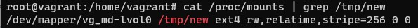

1. Могут ли файлы, являющиеся жесткой ссылкой на один объект, иметь разные права доступа и владельца? Почему?

        Нет, хардлинки не могут иметь разные права, так как они указывают на один и тот же объект в файловой системе (inode).

2. Создание дисков

3. Используя `fdisk`, разбейте первый диск на 2 раздела: 2 Гб, оставшееся пространство.

4. Используя `sfdisk`, перенесите данную таблицу разделов на второй диск.

5. Соберите `mdadm` RAID1 на паре разделов 2 Гб.

6. Соберите `mdadm` RAID0 на второй паре маленьких разделов.

7. Создайте 2 независимых PV на получившихся md-устройствах.

8. Создайте общую volume-group на этих двух PV.

9. Создайте LV размером 100 Мб, указав его расположение на PV с RAID0.

10. Создайте `mkfs.ext4` ФС на получившемся LV.

11. Смонтируйте этот раздел в любую директорию, например, `/tmp/new`.

12. Прикрепите вывод `lsblk`.

13. Протестируйте целостность файла:

14. Используя pvmove, переместите содержимое PV с RAID0 на RAID1.

15. Подтвердите выводом `dmesg`, что RAID1 работает в деградированном состоянии.

16. Протестируйте целостность файла, несмотря на "сбойный" диск он должен продолжать быть доступен:
