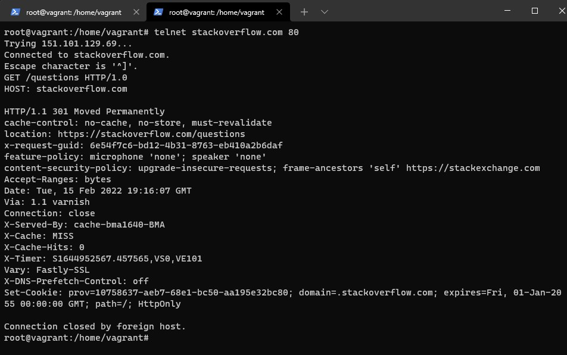
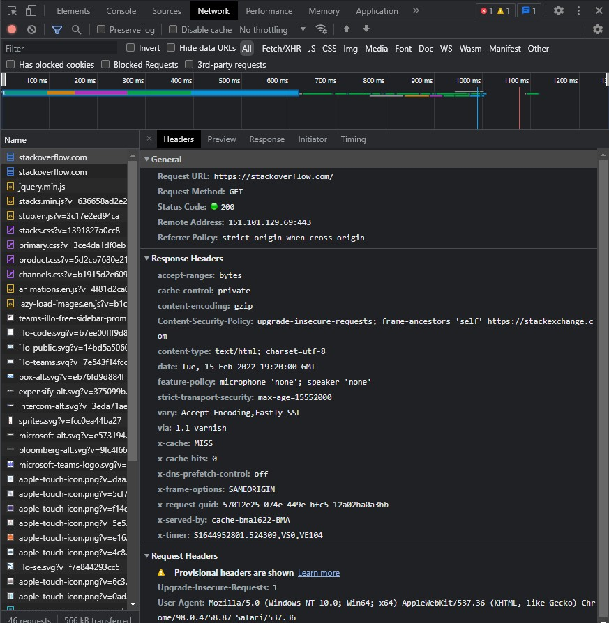
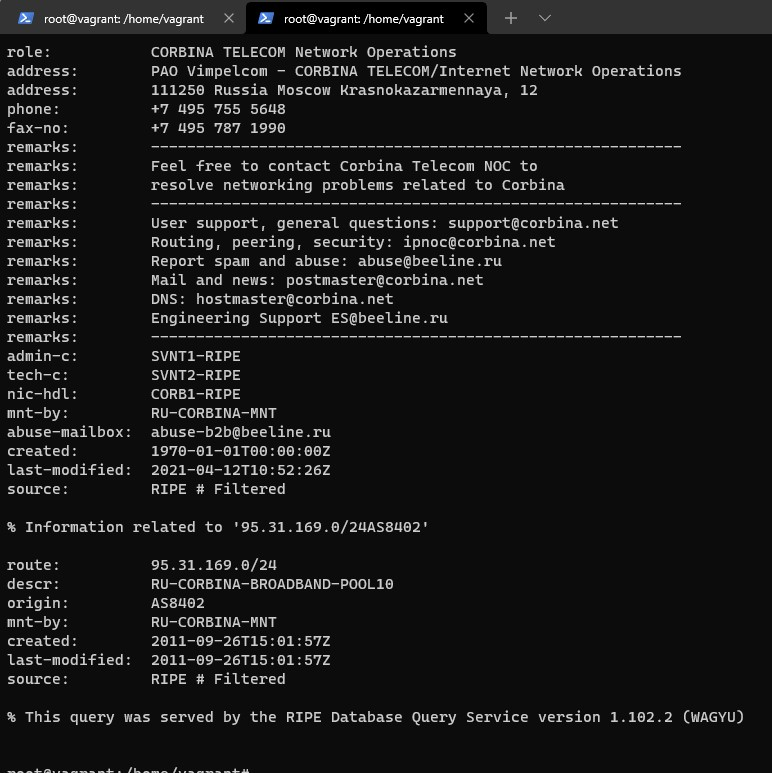
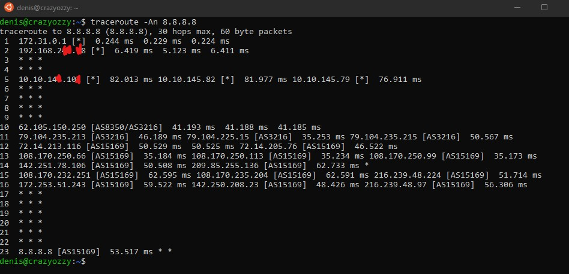
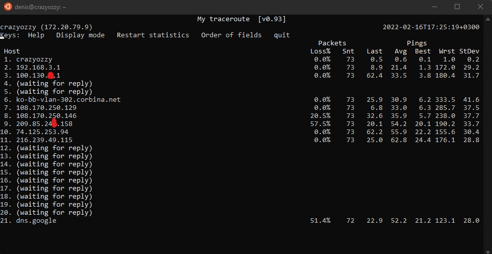
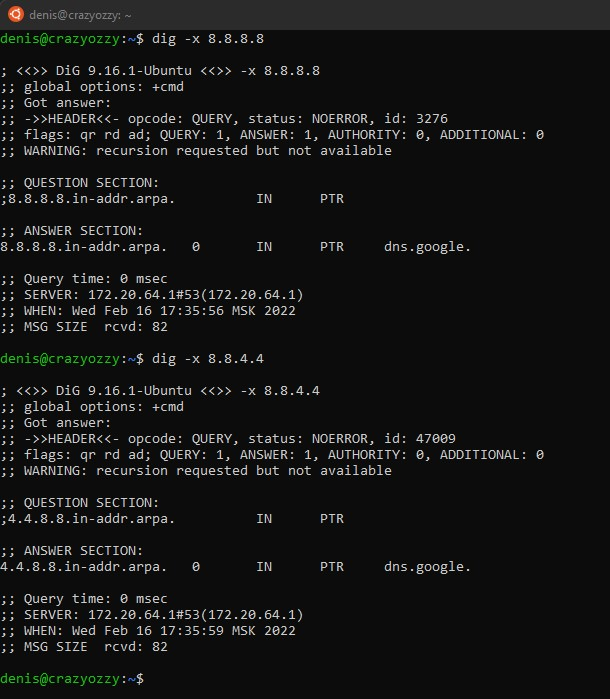

1. Работа c HTTP через телнет.
- Подключитесь утилитой телнет к сайту stackoverflow.com
`telnet stackoverflow.com 80`
- отправьте HTTP запрос
```bash
GET /questions HTTP/1.0
HOST: stackoverflow.com
[press enter]
[press enter]
```
- В ответе укажите полученный HTTP код, что он означает?

Код означает, что страница перемещена.
2. Повторите задание 1 в браузере, используя консоль разработчика F12.
- откройте вкладку `Network`
- отправьте запрос http://stackoverflow.com
- найдите первый ответ HTTP сервера, откройте вкладку `Headers`
- укажите в ответе полученный HTTP код.

    Status Code: 200 
- проверьте время загрузки страницы, какой запрос обрабатывался дольше всего?
    
    Страница загрузилась за 1.07секунды, дольше всего обрабатывался первый запрос.
- приложите скриншот консоли браузера в ответ.

3. Какой IP адрес у вас в интернете?
    Секрет) 

4. Какому провайдеру принадлежит ваш IP адрес? Какой автономной системе AS? Воспользуйтесь утилитой `whois`

CORBINA TELECOM Network Operations

descr:          RU-CORBINA-BROADBAND-POOL10

origin:         AS8402

5. Через какие сети проходит пакет, отправленный с вашего компьютера на адрес 8.8.8.8? Через какие AS? Воспользуйтесь утилитой `traceroute`

6. Повторите задание 5 в утилите `mtr`. На каком участке наибольшая задержка - delay?

Наибольшая средняя задержка на 11 хопе

7. Какие DNS сервера отвечают за доменное имя dns.google? Какие A записи? воспользуйтесь утилитой `dig`

За доменное имя dns.google.com отвечают следующие сервера:

;; ANSWER SECTION:

dns.google.com.         0       IN      A       8.8.4.4

dns.google.com.         0       IN      A       8.8.8.8

8. Проверьте PTR записи для IP адресов из задания 7. Какое доменное имя привязано к IP? воспользуйтесь утилитой `dig`
К обоим ip адресам привязано имя dns.google
