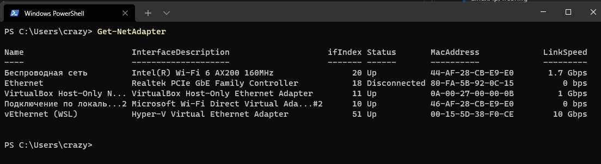
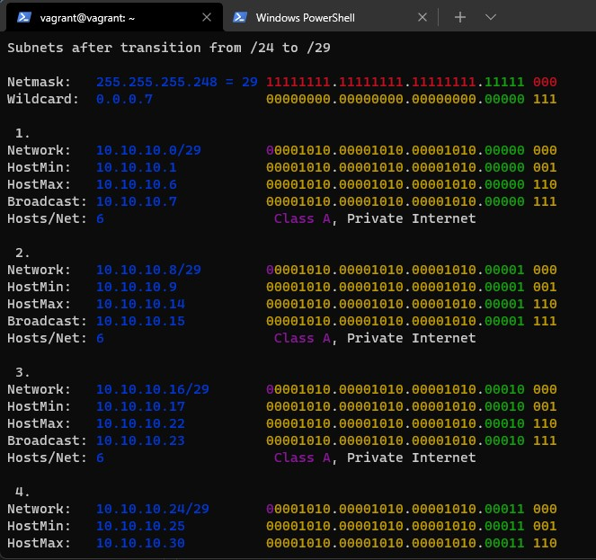
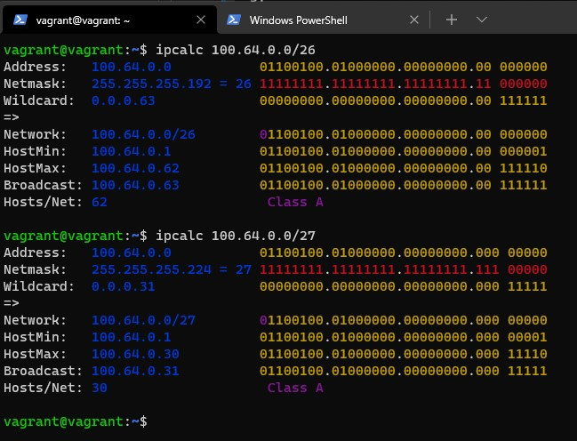

1. Проверьте список доступных сетевых интерфейсов на вашем компьютере. Какие команды есть для этого в Linux и в Windows?
>Linux: ip, ifconfig
>
>Windows: ipconfig, Get-NetAdapter


2. Какой протокол используется для распознавания соседа по сетевому интерфейсу? Какой пакет и команды есть в Linux для этого?
>Для распознавания соседей используется протокол LLDP. В Linux есть пакет lldpd и команда lldpctl.

3. Какая технология используется для разделения L2 коммутатора на несколько виртуальных сетей? Какой пакет и команды есть в Linux для этого? Приведите пример конфига.
>Для разделения на виртуальные сети используется технология VLAN. В Linux есть одноименный пакет vlan.
>Пример конфига, который я нашел:
```
auto eth0.1400
iface eth0.1400 inet static
        address 192.168.1.1
        netmask 255.255.255.0
        vlan_raw_device eth0
```
4. Какие типы агрегации интерфейсов есть в Linux? Какие опции есть для балансировки нагрузки? Приведите пример конфига.
>Есть статическая (Cisco mode on) и динамическая (LACP протокол, Cisco mode active) агрегация (LAG, бондинг).
>
>Для балансировки есть следующие опции параметра <strong>mode</strong>:
>><strong>balance-rr or 0</strong>  -  политика балансировки round robin, т.е. пакеты отправляются поочередно со всех доступных slave, т.е. включенных в бондинг, интерфейсов.
>>
>><strong>active-backup or 1</strong> - при данной опции будет активен только один slave интерфейс, остальные будут находится в режиме ожидания. В случае сбоя активного интерфейса он будет заменен интерфейсом из режима ожидания.
>>
>><strong>balance-xor or 2</strong> - режим балансировки основанный на выбранной в опции xmit_hash_policy политике херширования. Режим обеспечивает балансировку нагрузки и отказоустойчивость.
>>
>><strong>broadcast or 3</strong> - широковещательная политика, при которой все пакеты одновременно передаются со всех slave интерфейсов.
>>
>><strong>802.3ad or 4</strong> - режим динамической агрегации каналов в соответствии со стандартом 802.3ad.
>>
>><strong>balance-tlb or 5</strong> - адаптивная балансировка нагрузки не требующая поддержки со стороны свича. Исходящий трафик балансируется по всем slave портам, входящий трафик принимает только один порт.
>>
>><strong>balance-alb or 6</strong> - адаптивная балансировка нагрузки включающая в себя предыдущий режим balance-tlb плюс балансировку входящего трафика основанную на ARP negotiation.

5. Сколько IP адресов в сети с маской /29 ? Сколько /29 подсетей можно получить из сети с маской /24. Приведите несколько примеров /29 подсетей внутри сети 10.10.10.0/24.
>В сети с маской /29 будет 6 IP адресов.
>
>Из сети с маской /24 можно получить 32 подсети с маской /29


6. Задача: вас попросили организовать стык между 2-мя организациями. Диапазоны 10.0.0.0/8, 172.16.0.0/12, 192.168.0.0/16 уже заняты. Из какой подсети допустимо взять частные IP адреса? Маску выберите из расчета максимум 40-50 хостов внутри подсети.
>Можно взять IP адреса из подсети 100.64.0.0 — 100.127.255.255 (маска подсети: 255.192.0.0 или /10) - это специальная подсеть Carrier-Grade NAT предназначенная для связывания провайдеров и организаций.
>
>Можно выбрать маску /26 (62 хоста) или /27 (30 хостов):


7. Как проверить ARP таблицу в Linux, Windows? Как очистить ARP кеш полностью? Как из ARP таблицы удалить только один нужный IP?
>В Linux ARP таблицу можно проверить командой <strong>arp -n</strong>, полностью очистить таблицу можно командой <strong>ip -s -s neigh flush all</strong>, а удалить только одну запись командов <strong>arp -d \<ip-address\></strong>.
>
>В Windows вывести ARP таблицу можно проверить командой <strong>arp -a</strong>, полностью очистить таблицу можно командой <strong>arp -d *</strong>, а удалить только одну запись командов <strong>arp -d \<ip-address\></strong>.