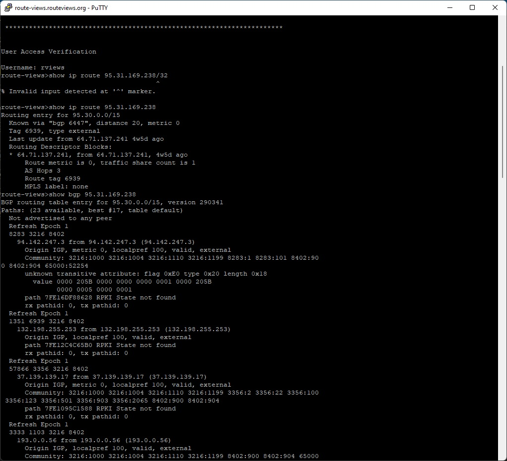
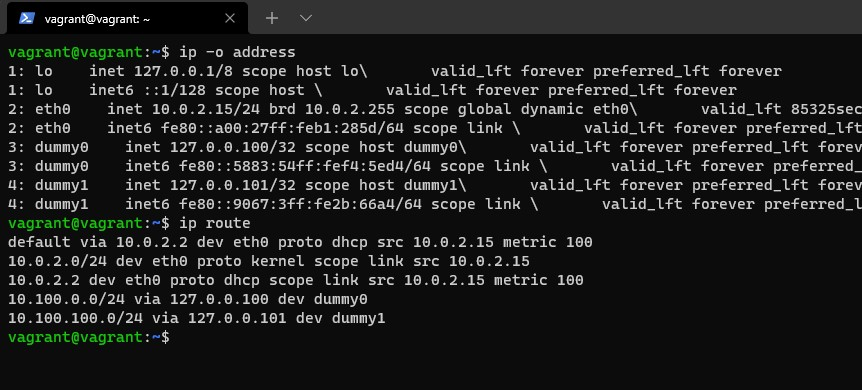
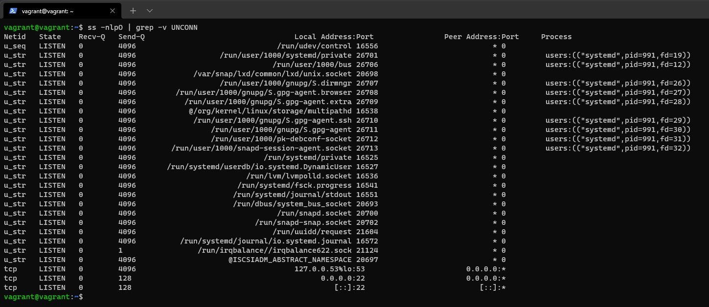
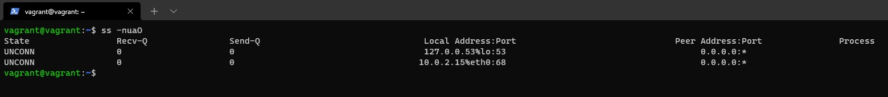
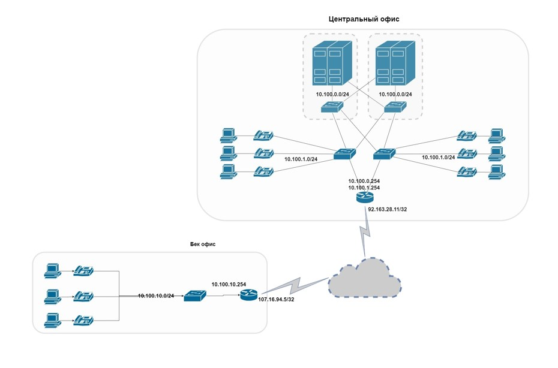

1. Подключитесь к публичному маршрутизатору в интернет. Найдите маршрут к вашему публичному IP

2. Создайте dummy0 интерфейс в Ubuntu. Добавьте несколько статических маршрутов. Проверьте таблицу маршрутизации.

3. Проверьте открытые TCP порты в Ubuntu, какие протоколы и приложения используют эти порты? Приведите несколько примеров.
> Например 22 порт использует ssh сервер, 53 DNS

4. Проверьте используемые UDP сокеты в Ubuntu, какие протоколы и приложения используют эти порты?
>53 порт использует DNS, 68 DHCP клиент

5. Используя diagrams.net, создайте L3 диаграмму вашей домашней сети или любой другой сети, с которой вы работали. 

 ---